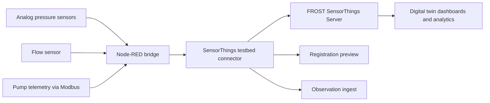

# Architecture Diagram

## Interpretation

This architecture keeps the integration intentionally lightweight:

- Node-RED gathers or simulates heterogeneous sensor input
- the connector normalizes payloads for the SensorThings model
- the FROST server acts as the central standards-based observation store
- downstream clients can query the observations for monitoring, optimization, and digital twin scenarios
