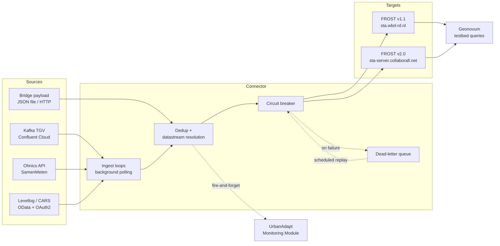
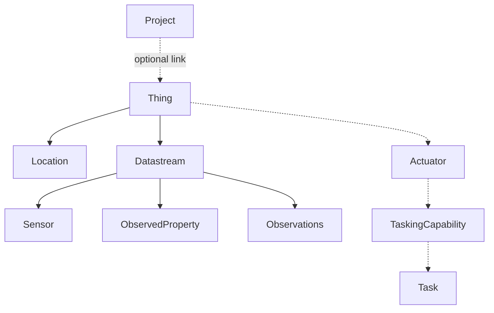

# Architecture Diagram

## System overview

```mermaid
flowchart LR
    subgraph Sources
        KF[Kafka TGV<br/>Confluent Cloud]
        OH[Ohnics API<br/>SamenMeten]
        LL[Levellog / CARS<br/>OData + OAuth2]
        BR[Bridge payload<br/>JSON file / HTTP]
    end

    subgraph Connector
        IL[Ingest loops<br/>background polling]
        DD[Dedup +<br/>datastream resolution]
        CB[Circuit breaker]
        DLQ[Dead-letter queue]
    end

    subgraph Targets
        F1[FROST v1.1<br/>sta.wbd-rd.nl]
        F2[FROST v2.0<br/>sta-server.collaborall.net]
    end

    MON[UrbanAdapt<br/>Monitoring Module]
    GN[Geonovum<br/>testbed queries]

    KF --> IL
    OH --> IL
    LL --> IL
    BR --> DD
    IL --> DD
    DD --> CB
    CB --> F1
    CB --> F2
    CB -.->|on failure| DLQ
    DLQ -.->|scheduled replay| CB
    DD -.->|fire-and-forget| MON
    F1 --> GN
    F2 --> GN
```

## SensorThings entity model

```mermaid
flowchart TD
    Project[Project] -.->|optional link| Thing
    Thing --> Location
    Thing --> Datastream
    Datastream --> Sensor
    Datastream --> ObservedProperty
    Datastream --> Observations
    Thing -.-> Actuator
    Actuator -.-> TaskingCapability
    TaskingCapability -.-> Task
```

## Interpretation

The connector ingests data from multiple sources through background polling loops:

- **Kafka TGV**: Confluent Cloud consumer with Avro deserialization for indoor climate data
- **Ohnics**: REST polling for outdoor air quality (SamenMeten network in Delft)
- **Levellog / CARS**: REST polling with OAuth2 for groundwater levels
- **Bridge payload**: file-backed or HTTP POST readings from Node-RED or other sources

All readings pass through deduplication (timestamp-based) and datastream resolution (static ID map, then live OData lookup). The circuit breaker provides per-target fault tolerance, skipping unreachable targets after consecutive failures and retrying after a cooldown.

Observations fan out to all configured FROST targets independently. The v2.0 adapter converts v1.1 entity payloads to the v2.0 format at the HTTP boundary. Each target has its own entity cache and HTTP client.

Failed observations are appended to the dead-letter queue and replayed on a schedule. After a successful FROST push, observations are also forwarded to the UrbanAdapt Monitoring Module (direct HTTP push and MQTT bridge).

Dashed lines indicate optional or conditional flows (tasking extensions, fire-and-forget monitoring push, DLQ replay).
