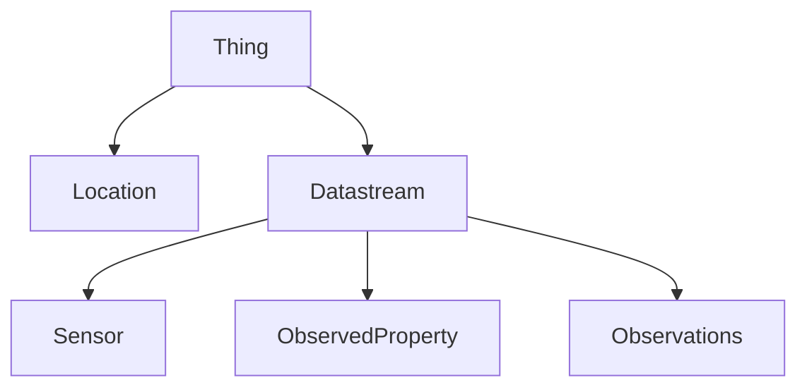

# Architecture Diagram

```mermaid
flowchart LR
    TGV[TGV sensors] --> AT[Adapter: TGV]
    BL[Blijdorp sensors] --> AB[Adapter: Blijdorp]
    AT --> CC[Connector core]
    AB --> CC
    CC --> FS[FROST Server (Brabantse Delta)]
    CC --> UM[UrbanAdapt Monitoring Module]
    FS --> Q[Geonovum testbed queries]
    UM --> UP[UrbanAdapt platform]
```

```mermaid
flowchart TD
    Thing[Thing] --> Location[Location]
    Thing --> Datastream[Datastream]
    Datastream --> Sensor[Sensor]
    Datastream --> ObservedProperty[ObservedProperty]
    Datastream --> Observations[Observations]
```

## Interpretation

This architecture keeps the integration intentionally lightweight:

- the TGV and Blijdorp adapters normalize site-specific sensor feeds
- the connector core registers SensorThings entities and forwards observations
- the FROST server is the central SensorThings store for the Geonovum testbed
- the UrbanAdapt monitoring module can reuse the same observations downstream
